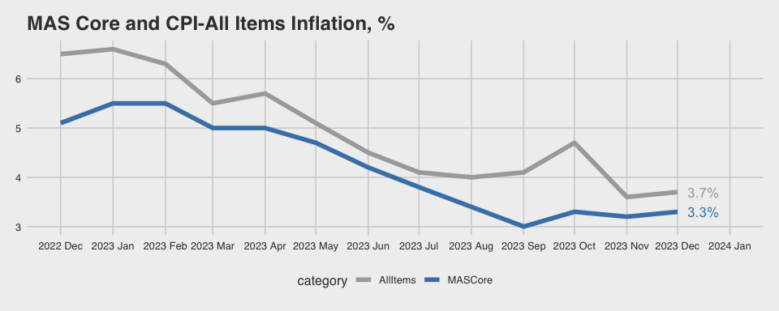

Week 4 Applications
================
2025-02-06

# Applications

Download `wk4_cpi2023.pdf` from Canvas. The data contain **Singapore’s
Consumer Price Index (CPI) in 2023**.

It was originally retrieved from
[here](https://www.mas.gov.sg/monetary-policy/consumer-price-developments).

Let’s read the file into `R`.

``` r
library(tidyverse)
library(ggthemes)
library(pdftools)
txt <- pdf_text("../data/wk4_cpi2023.pdf")
```

## CPI for key categories

We first extract the table on Page 7. This will give us the **CPI for
key categories, with 2019 as the base year**.

``` r
# Table on page 7
tab1 <- txt[7]

# Split text file into rows
rows <- str_split(tab1, "\\n+", simplify = TRUE) %>% str_trim()
  
# Column names in lines 4-6
names1 <- rows[4] %>%
  str_trim() %>%
  str_split("\\s{2,}", simplify = TRUE)

names2 <- rows[5] %>%
  str_trim() %>%
  str_split("\\s{2,}", simplify = TRUE) 
names2 <- c("", "", names2[c(1:2)], "", "", names2[c(3:6)])

names3 <- rows[6] %>%
  str_trim() %>%
  str_split("\\s{2,}", simplify = TRUE) 
names3 <- c("", "", names3[1], "", "", "", names3[2], "", "", "")

colnames <- str_c(names1, names2, names3, sep = " ") %>% 
  str_replace_all("\\s", "") %>%
  append("Month", after = 0)
colnames
```

    ##  [1] "Month"                "AllItems"             "MASCore"             
    ##  [4] "CPILessAccommodation" "CPILessOOA"           "Food"                
    ##  [7] "Services"             "Retail&OtherGoods"    "Electricity&Gas"     
    ## [10] "PrivateTransport"     "Accommodation"

``` r
# Final table on page 7
rows[8:20] %>%
  str_trim() %>%
  str_split("\\s{2,}", simplify = TRUE) %>%
  data.frame() %>%
  setNames(colnames) %>%
  mutate_at(-1, parse_number) -> tab1

tab1
```

<div class="kable-table">

| Month | AllItems | MASCore | CPILessAccommodation | CPILessOOA | Food | Services | Retail&OtherGoods | Electricity&Gas | PrivateTransport | Accommodation |
|:---|---:|---:|---:|---:|---:|---:|---:|---:|---:|---:|
| 2022 Dec | 111.186 | 107.316 | 111.790 | 111.609 | 112.182 | 106.111 | 100.103 | 115.666 | 135.911 | 109.040 |
| 2023 Jan | 111.397 | 108.195 | 112.313 | 111.733 | 113.743 | 106.669 | 100.861 | 115.037 | 134.513 | 108.142 |
| Feb | 112.019 | 108.173 | 112.622 | 112.444 | 113.818 | 106.270 | 101.676 | 115.321 | 136.608 | 109.876 |
| Mar | 112.583 | 108.441 | 113.233 | 113.035 | 114.243 | 106.424 | 101.858 | 116.237 | 139.066 | 110.274 |
| Apr | 112.669 | 108.856 | 114.019 | 113.058 | 114.636 | 107.085 | 102.214 | 113.105 | 141.854 | 107.873 |
| May | 113.034 | 108.957 | 113.615 | 113.422 | 115.061 | 107.072 | 101.918 | 113.890 | 138.723 | 110.971 |
| Jun | 113.576 | 109.163 | 114.219 | 114.002 | 115.101 | 107.513 | 101.811 | 113.784 | 141.475 | 111.293 |
| Jul | 113.309 | 109.383 | 114.202 | 113.562 | 115.293 | 107.744 | 101.976 | 114.498 | 140.174 | 110.139 |
| Aug | 114.303 | 109.465 | 114.845 | 114.685 | 115.479 | 107.829 | 101.874 | 114.415 | 143.849 | 112.378 |
| Sep | 114.880 | 109.602 | 115.495 | 115.312 | 115.649 | 108.146 | 101.423 | 114.664 | 147.267 | 112.694 |
| Oct | 115.111 | 110.033 | 116.226 | 115.521 | 115.855 | 108.610 | 101.832 | 117.147 | 149.612 | 111.151 |
| Nov | 114.910 | 110.154 | 115.369 | 115.223 | 116.248 | 108.809 | 101.242 | 117.157 | 143.478 | 113.281 |
| Dec | 115.343 | 110.866 | 115.844 | 115.684 | 116.340 | 110.241 | 101.191 | 117.168 | 142.681 | 113.562 |

</div>

## Year-on-year inflation

Using a similar approach, we can extract data on Page 8. This gives us
the **year-on-year inflation on key CPI categories**.

``` r
# Table on page 8
tab2 <- txt[8]

# Split text file into rows
rows <- str_split(tab2, "\\n+", simplify = TRUE) %>% str_trim()
# Same column names as the previous table
colnames
```

    ##  [1] "Month"                "AllItems"             "MASCore"             
    ##  [4] "CPILessAccommodation" "CPILessOOA"           "Food"                
    ##  [7] "Services"             "Retail&OtherGoods"    "Electricity&Gas"     
    ## [10] "PrivateTransport"     "Accommodation"

``` r
# Final table on page 8
rows[7:19] %>%
  str_trim() %>%
  str_split("\\s{2,}", simplify = TRUE) %>%
  data.frame() %>%
  setNames(colnames) %>%
  mutate_at(-1, parse_number) -> tab2

tab2
```

<div class="kable-table">

| Month | AllItems | MASCore | CPILessAccommodation | CPILessOOA | Food | Services | Retail&OtherGoods | Electricity&Gas | PrivateTransport | Accommodation |
|:---|---:|---:|---:|---:|---:|---:|---:|---:|---:|---:|
| 2022 Dec | 6.5 | 5.1 | 6.9 | 6.7 | 7.5 | 3.7 | 2.8 | 16.5 | 15.5 | 4.7 |
| 2023 Jan | 6.6 | 5.5 | 7.1 | 6.9 | 8.1 | 4.2 | 3.3 | 11.5 | 14.3 | 5.0 |
| Feb | 6.3 | 5.5 | 6.7 | 6.5 | 8.1 | 3.9 | 3.8 | 12.1 | 12.1 | 4.9 |
| Mar | 5.5 | 5.0 | 5.7 | 5.6 | 7.7 | 3.4 | 3.3 | 12.2 | 8.6 | 4.8 |
| Apr | 5.7 | 5.0 | 6.0 | 5.9 | 7.1 | 4.3 | 2.9 | 2.7 | 10.4 | 4.9 |
| May | 5.1 | 4.7 | 5.2 | 5.1 | 6.8 | 3.9 | 2.8 | 3.3 | 7.2 | 4.7 |
| Jun | 4.5 | 4.2 | 4.5 | 4.5 | 5.9 | 3.6 | 2.7 | 3.1 | 5.8 | 4.5 |
| Jul | 4.1 | 3.8 | 4.0 | 4.0 | 5.3 | 3.6 | 2.6 | -1.6 | 4.8 | 4.6 |
| Aug | 4.0 | 3.4 | 3.9 | 3.9 | 4.8 | 3.1 | 2.0 | -1.4 | 6.3 | 4.4 |
| Sep | 4.1 | 3.0 | 4.1 | 4.1 | 4.3 | 3.1 | 0.9 | -1.4 | 8.5 | 4.3 |
| Oct | 4.7 | 3.3 | 4.9 | 4.9 | 4.1 | 3.4 | 1.6 | 1.8 | 11.7 | 4.2 |
| Nov | 3.6 | 3.2 | 3.4 | 3.4 | 4.0 | 3.5 | 1.0 | 1.5 | 4.2 | 4.1 |
| Dec | 3.7 | 3.3 | 3.6 | 3.7 | 3.7 | 3.9 | 1.1 | 1.3 | 5.0 | 4.1 |

</div>

**The following code plots the year-on-year inflation.**

``` r
# Prepare data for plot
tab2 %>%
  select(1:3) %>%
  separate(Month, into = c("year", "month"), fill = "left") %>%
  mutate(year = case_when(
    is.na(year) ~ "2023",
    TRUE ~ year
  )) %>%
  mutate(yr_month = ym(paste(year, month, sep = "-"))) %>%
  pivot_longer(AllItems:MASCore, names_to = "category", values_to = "inflation") %>%
  select(yr_month, category, inflation) -> tab3

tab4 <- tab3 %>% filter(yr_month == "2023-12-01")
range <-  c(as.Date("2022-12-01"), as.Date("2024-01-01"))
```

``` r
ggplot(data = tab3, aes(x = yr_month, y = inflation, color = category)) +
  geom_line(lwd = 2) +
  geom_text(data = tab4, aes(label = paste0(inflation, "%")), 
            size = 4.5, hjust = "left", nudge_x = 6, show.legend = FALSE) +
  scale_x_date(date_breaks = "1 month", date_labels = "%Y %b", limits = range) +
  scale_color_manual(values = c("darkgray", "steelblue")) +
  labs(title = "MAS Core and CPI-All Items Inflation, %") +
  theme_fivethirtyeight()
```

<!-- -->
